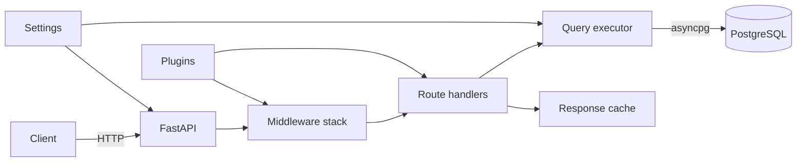
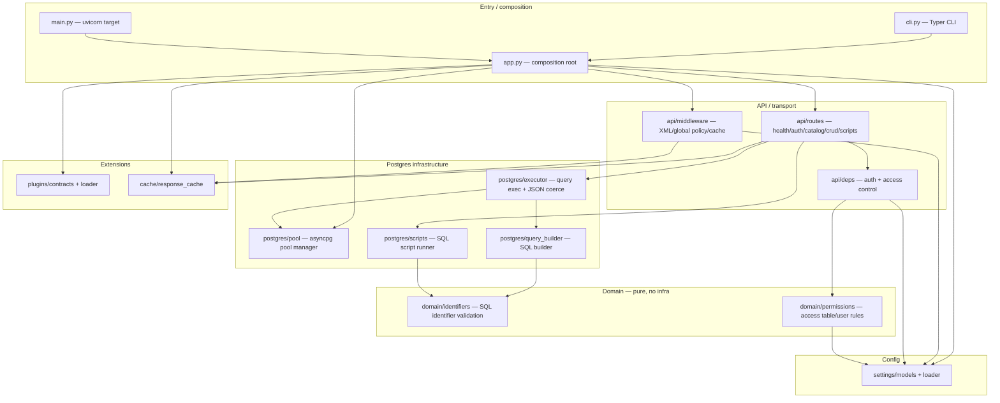
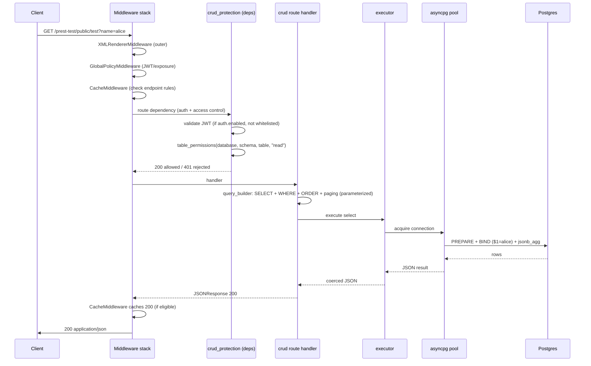
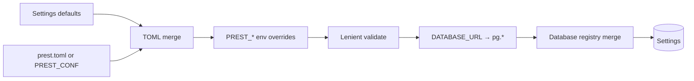
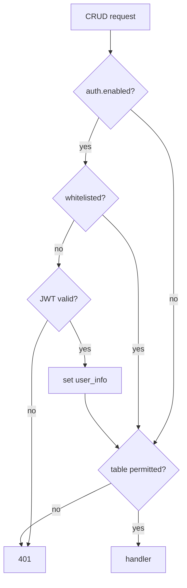

# Architecture

How the pREST Python rewrite is built. Read this once before contributing.
Pair with `docs/onboarding.md` (learning path) and `CONTRIBUTING.md` (how to
change things).

## Big picture

pREST exposes a Postgres database over REST without an ORM. There are no
table models in code. The server introspects the database at runtime and turns
HTTP requests into parameterized SQL, then returns rows as JSON.

The Python rewrite (`prest_py/`) targets **API contract parity** with the Go
`prestd` binary. Both talk to the same Postgres. Migrations stay on the Go
binary; the Python server serves the API.



## Layered architecture

Dependency direction is **inward only**. Inner layers never import outer ones.



### Dependency rule

| Layer | May depend on | May NOT depend on |
|---|---|---|
| `domain/` | stdlib only | settings, postgres, api, infra |
| `settings/` | pydantic, stdlib | domain (it models config, not rules) |
| `postgres/` | `domain`, `settings`, asyncpg | `api`, `app` |
| `cache/`, `plugins/` | fastapi contracts, settings | `api` internals, `app` |
| `api/` | `domain`, `settings`, `postgres`, `cache` | `app`, `cli` |
| `app.py` | everything (composition root) | — |
| `cli.py`, `main.py` | `app`, `settings` | internal layers directly |

If you find yourself importing `api` from `postgres`, or `app` from a route,
stop — the boundary is wrong.

## Module map

| Package | Owns | Key files |
|---|---|---|
| `prest_py/settings/` | Config schema + loader (defaults < TOML < env) | `models.py`, `loader.py` |
| `prest_py/domain/` | Pure rules: SQL identifier validation/quoting, access-table permission matching | `identifiers.py`, `permissions.py` |
| `prest_py/postgres/` | DB infrastructure: pool, SQL builder, executor, script runner | `pool.py`, `query_builder.py`, `executor.py`, `scripts.py` |
| `prest_py/api/routes/` | HTTP handlers: health, auth, catalog, CRUD, scripts | `health.py`, `auth.py`, `catalog.py`, `crud.py`, `scripts.py` |
| `prest_py/api/deps.py` | Request-time auth (JWT) + access-control dependencies for CRUD | `deps.py` |
| `prest_py/api/middleware.py` | Cross-cutting: XML renderer, global JWT/exposure policy, response cache | `middleware.py` |
| `prest_py/cache/` | In-memory TTL response cache + endpoint rules | `response_cache.py` |
| `prest_py/plugins/` | Import-string plugin contract + fail-fast loader | `contracts.py`, `loader.py` |
| `prest_py/app.py` | Composition root: wires settings, plugins, middleware, routes, lifespan/pool | `app.py` |
| `prest_py/cli.py` | Typer CLI: `serve`, `version`, `migrate` stub | `cli.py` |
| `prest_py/main.py` | `app = create_app()` — uvicorn import target | `main.py` |

## Request lifecycle

A CRUD GET flows through every layer. This is the canonical path to
understand.



Key points:

- **Middleware order** (outer → inner, as added in `app.py`): `XMLRendererMiddleware` → `GlobalPolicyMiddleware` → `CacheMiddleware` → plugin middleware (config order) → routes. Starlette runs last-added first, so the code adds them in reverse to get this runtime order.
- **Auth is a route dependency, not global middleware.** `crud_protection` (auth + access control) runs only on CRUD routes, matching Go's `CRUDStack`. Health, auth, catalog, and scripts routes are not wrapped by it.
- **Global JWT** (`jwt.default`) is enforced in `GlobalPolicyMiddleware` and validates tokens everywhere except whitelisted paths — but it does *not* populate request user context (matches Go's separate `JwtMiddleware`). User context is set only by the CRUD-specific `auth_dependency`.
- **Cache** only acts on enabled + GET + endpoint-rule match, and only caches 200s. Cache hits skip plugin middleware and the DB entirely.

## Config load flow



`load_settings(config_path, env)` in `settings/loader.py`. Priority: defaults < TOML < env (matches Go). Missing TOML is tolerated. Invalid env casts are ignored **except** plugin config, which fails closed (a malformed plugin list must never silently disable plugins).

## Pool lifecycle

```mermaid
sequenceDiagram
  participant U as uvicorn
  participant L as lifespan
  participant PM as PoolManager
  participant DB as Postgres

  U->>L: startup
  L->>PM: PoolManager(settings)
  L->>PM: connect() — open default pool, SELECT 1
  PM->>DB: asyncpg.create_pool(min_size, max_size)
  DB-->>PM: ok
  Note over PM: pools keyed by URI; aliases sharing a URI share a pool
  U->>L: serve requests (acquire/release per request)
  ...
  U->>L: shutdown
  L->>PM: close() — close all pools
```

Pools are **lazy + single-flight**: the first request for an alias creates its pool under a lock; concurrent first requests share one creation. `pg.single=true` rejects non-default aliases when a registry is active.

## Auth & access control

Two separate concerns, do not confuse them:

1. **Global JWT validation** (`jwt.default` in `GlobalPolicyMiddleware`): validates bearer tokens on all non-whitelisted requests. No user context. Use this to require login everywhere.
2. **CRUD auth + access control** (`crud_protection` dependency): validates JWT *and* checks `access.tables` / `access.users` permissions per table+method. Sets `request.state.user_info`. Runs only on `/{database}/{schema}/{table}` routes.



Permission mapping: GET→read, POST/PUT/PATCH→write, DELETE→delete.

## Plugin extension model

Plugins are trusted Python packages loaded from import strings at app creation.

```mermaid
flowchart LR
  Cfg[plugins.entries] --> Load[load_plugins]
  Load --> Resolve[import_module + getattr]
  Resolve --> Reg[register() → PluginRegistration]
  Reg --> V[validate: routers/middleware types]
  V --> Conf[route conflict check vs core]
  Conf --> App[compose: plugin routes first, plugin middleware inside policy]
```

- Plugin exact routes register **before** broad `/{database}/{schema}` patterns (else dynamic routes eat them).
- Exact path+method collisions with core or earlier plugin routes fail app creation.
- Plugin middleware runs **inside** XML/global-policy/cache — it cannot reorder those boundaries and is skipped on cache hits.

See `docs/python-plugins.md`.

## Key design rules (ported from Go)

1. **Identifiers are validated before SQL assembly.** `domain/identifiers.py` `is_valid` / `quote` / `is_safe_segment`. Never concatenate a path param into SQL.
2. **Filter values are always parameterized** with `$n` placeholders via the `Query` dataclass. No string interpolation of values.
3. **Fail closed on misconfigured security.** Empty JWT key with `jwt.default` on, or JWKS/OpenID set → app creation raises (the runtime cannot enforce asymmetric-key auth, so it refuses to pretend).
4. **Contract parity over novelty.** The Go binary is the oracle. `tests/contract/` freezes the HTTP contract; `scripts/run-parity.sh` proves live equivalence.
5. **No ORM models.** Schema is the database. pREST introspects at runtime.

## Where things go (cheat sheet)

| You want to... | Edit |
|---|---|
| Add/clone an endpoint | `prest_py/api/routes/<area>.py`, register in `routes/__init__.py` |
| Change SQL generation | `prest_py/postgres/query_builder.py` |
| Change how rows become JSON | `prest_py/postgres/executor.py` |
| Add a config key | `prest_py/settings/models.py` + env map in `loader.py` |
| Change auth/access rules | `prest_py/api/deps.py` + `prest_py/domain/permissions.py` |
| Add middleware | `prest_py/api/middleware.py` + wire in `app.py` (mind order) |
| Add a plugin hook | `prest_py/plugins/contracts.py` + `loader.py` |
| Change CLI | `prest_py/cli.py` |
| Add a test | `tests/python/` (unit) or `tests/contract/` (HTTP contract) |